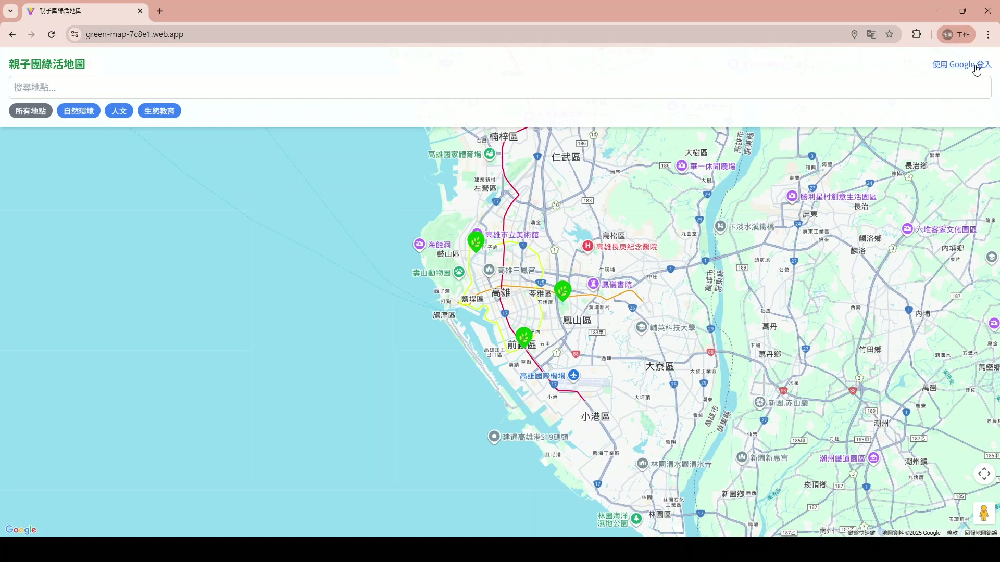
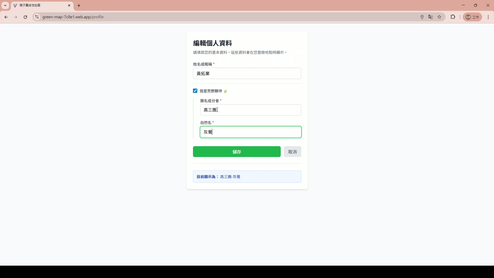
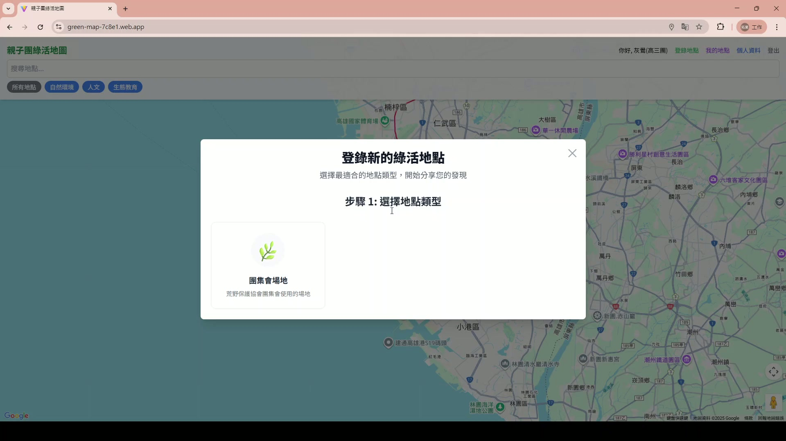
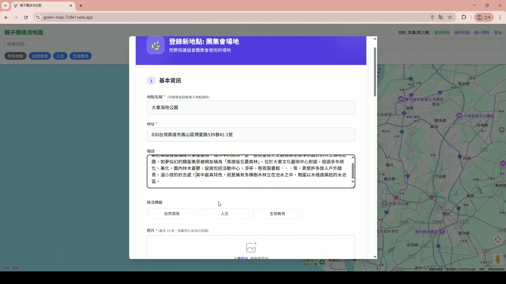
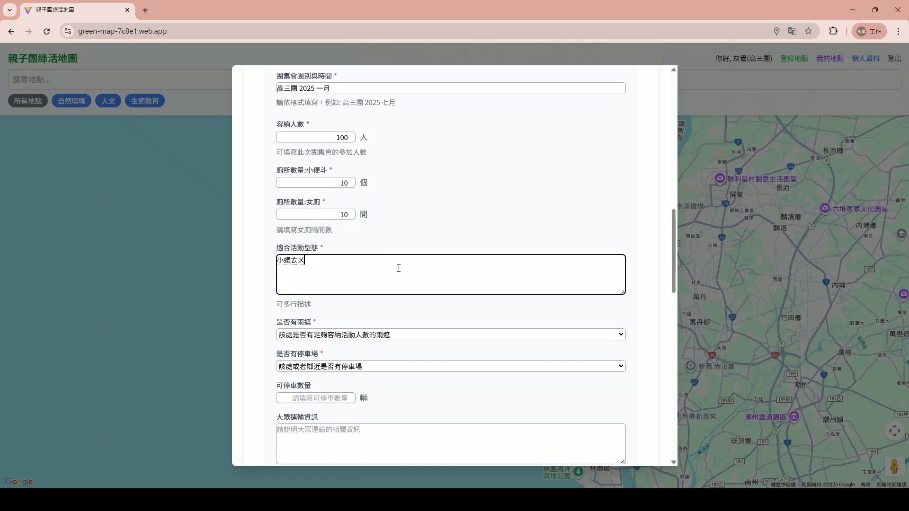
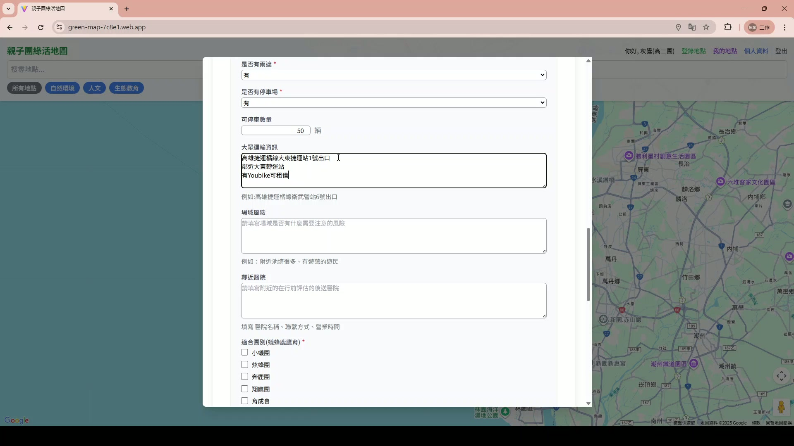
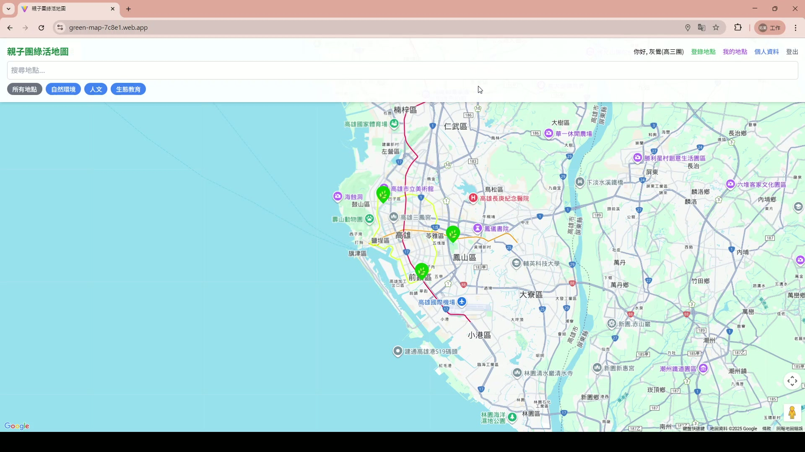

## 1. 系統登入與首頁

### 步驟 1：進入平台
1.  開啟瀏覽器進入平台首頁。
2.  若尚未登入，請點擊右上角「登入」按鈕進行身分驗證。
3.  登入成功後，將進入地圖主畫面，右上角顯示您的使用者名稱。
> 

---

## 2. 個人資料設定

### 步驟 1：進入編輯模式
點擊右上角使用者名稱（或頭像），在下拉選單中選擇「編輯個人資料」。
> 

### 步驟 2：修改與儲存
在彈出的視窗中，修改您的「顯示名稱」或「自然名」，完成後點擊綠色「儲存」按鈕。
> 

---

## 3. 新增地點流程

### 步驟 1：啟動新增功能
點擊介面左上角的藍色「登錄新地點」按鈕。
> 

### 步驟 2：選擇地點類型
在彈出的視窗中，選擇符合該場地屬性的圖示（例如：匯集集會場地）。
> 

### 步驟 3：填寫基本資訊
依序輸入「地點名稱」、「地址」及「描述」，這有助於使用者了解場地基本狀況。
> 

### 步驟 4：選擇標籤
在「商店標籤」欄位，選擇合適的分類標籤（如：人文、生態教育）。
> 

### 步驟 5：上傳場地照片
點擊虛線框區域，從電腦中選擇並上傳場地照片（支援 PNG, JPG）。
> 

### 步驟 6：填寫場地詳細數據
點擊下一步後，填寫活動相關數據：
* **容納人數**：輸入可容納的參加人數。
* **廁所數量**：輸入廁所間數與評分。
> 

### 步驟 7：填寫交通與風險資訊
向下滑動，詳細描述：
* **交通**：停車費率、大眾運輸建議。
* **風險**：場域潛在風險、鄰近補給點（便利商店）、最近醫院。
> 

### 步驟 8：勾選活動類型
勾選此場地適合進行的活動團體類型（如：小蟻團、炫蜂團）。
> 

### 步驟 9：填寫管理資訊並提交
最後輸入「收費標準」、「面積」及「管理單位聯絡資訊」。確認所有資料無誤後，點擊底部的「確認提交地點」。
> 
> 

---

## 4. 檢視成果

### 步驟 1：查看地圖標記
提交成功後，地圖上會立即出現新的綠色地標圖示。
> 

### 步驟 2：瀏覽詳細資訊
點擊地標圖示，左側將展開資訊卡片，顯示剛才輸入的所有詳細資料。
> 
